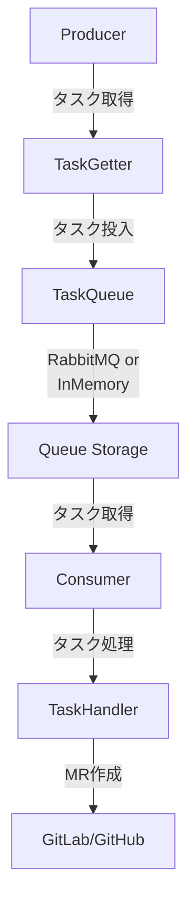
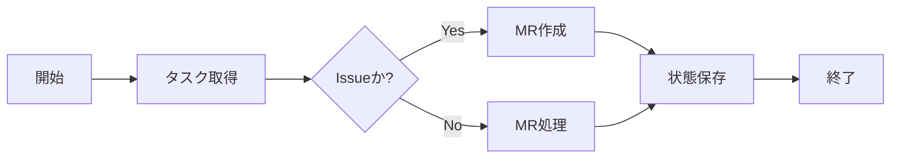
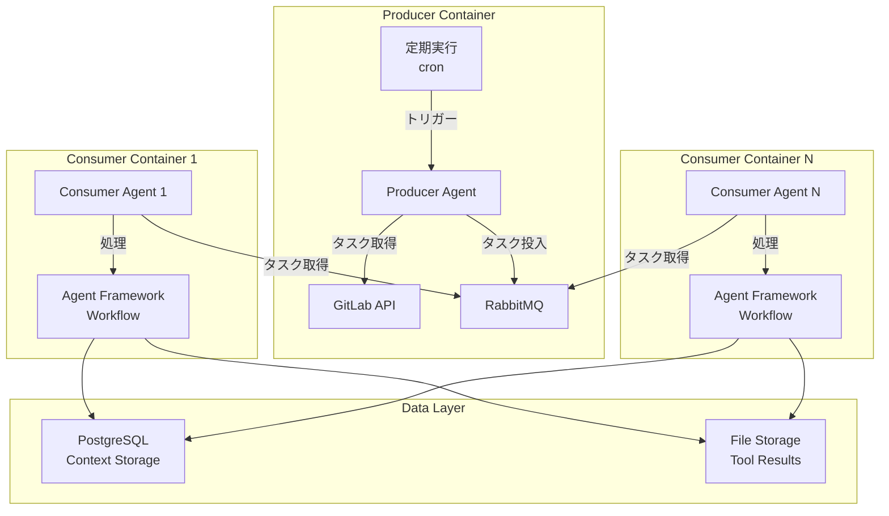
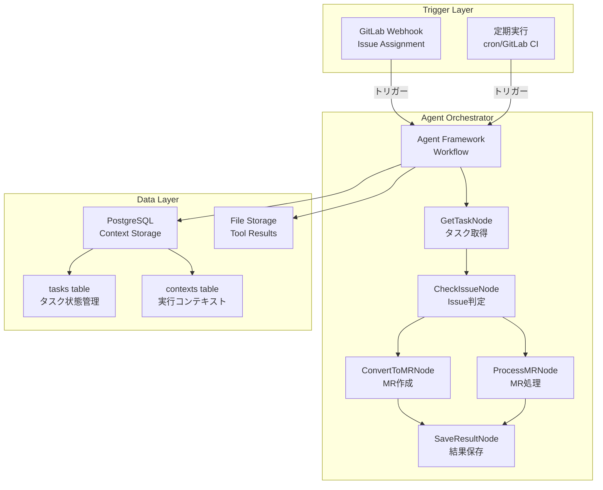
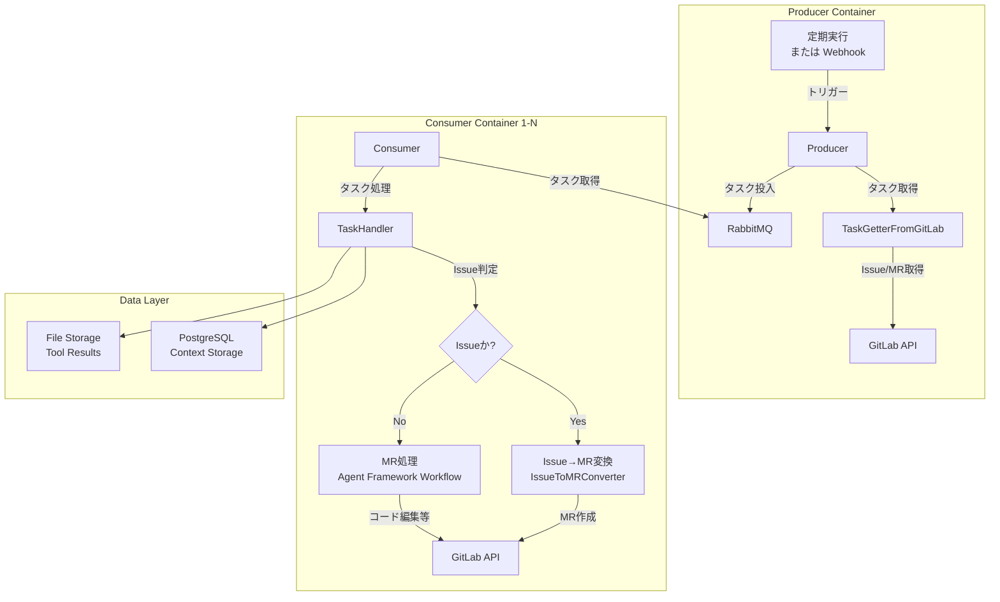

# Producer/Consumerパターン分析レポート

## 1. 目的

coding_agentで採用されているProducer/Consumerパターンが、Microsoft Agent Framework（Python版）を使用するCodeAgentOrchestratorにおいて有効かを検討する。

## 2. coding_agentにおけるProducer/Consumerパターン

### 2.1 アーキテクチャ概要

coding_agentは以下の構成でProducer/Consumerパターンを実装している:



### 2.2 主要コンポーネント

#### Producer (`main.py::produce_tasks()`)
- **役割**: GitLab/GitHubからIssue/MRを取得し、キューに投入
- **処理**:
  1. `TaskGetter.get_task_list()` でタスクリストを取得
  2. 各タスクに `task.prepare()` でラベル付与
  3. UUID生成、ユーザー情報取得
  4. `task_queue.put()` でキュー投入

#### Consumer (`main.py::consume_tasks()`)
- **役割**: キューからタスクを取得し、処理を実行
- **処理**:
  1. `task_queue.get()` でタスクキーを取得
  2. `task_getter.from_task_key()` でTaskインスタンスを生成
  3. `handler.handle(task)` でタスク処理を実行

#### TaskQueue
- **RabbitMQTaskQueue**: 分散環境でのタスクキュー（Producer/Consumer別プロセス可能）
- **InMemoryTaskQueue**: 単一プロセス内でのシンプルなキュー

### 2.3 継続動作モード

- **`run_producer_continuous()`**: 定期的にタスクを取得してキューに投入し続ける
- **`run_consumer_continuous()`**: キューからタスクを取得して処理し続ける
- **分離実行**: `--mode producer` または `--mode consumer` で独立して実行可能

### 2.4 利点

1. **スケーラビリティ**: Producer/Consumerを別コンテナでスケールアウト可能
2. **耐障害性**: Consumerがクラッシュしてもキューにタスクが残る
3. **レート制限対応**: Consumer側で処理速度を制御できる
4. **負荷分散**: 複数Consumerでタスクを並列処理可能

## 3. Microsoft Agent Frameworkの特性

### 3.1 Agent Frameworkの標準機能

Agent Frameworkは以下の機能を提供:

| 機能 | 説明 | Producer/Consumerとの関連性 |
|------|------|------------------------------|
| **Graph-based Workflows** | ノードとエッジで構成されたワークフロー定義 | タスク処理フローの実装に有効 |
| **Agent Providers** | OpenAI, Azure OpenAI, Anthropic等のLLM統合 | LLM呼び出しの標準化 |
| **Context Storage** | SQLベースの状態管理 | タスク状態管理に利用可能 |
| **Middleware System** | エラーハンドリング、リトライ、認証 | タスク処理の堅牢性向上 |
| **OpenTelemetry** | 分散トレーシング、メトリクス収集 | タスク処理のモニタリング |
| **MCP Integration** | Model Context Protocol対応 | ツール統合の標準化 |

### 3.2 Agent Frameworkのワークフロー設計

Agent Frameworkは**グラフベースのステートマシン**として動作:



**重要な特性**:
- ワークフローは**1回の実行サイクル**で完結
- 状態はContext Storageに永続化
- 次回実行は外部トリガー（webhook, cron等）で起動

### 3.3 Agent Frameworkに「タスクキュー」はない

Agent Frameworkの標準機能には**分散タスクキューの概念は含まれない**:

- **含まれないもの**:
  - RabbitMQ/Redis等のメッセージキュー統合
  - Producer/Consumerパターンのサポート
  - タスクキューの管理機構

- **代替手段**:
  - **Context Storage (SQL)**: タスクの状態管理
  - **File Storage**: 大規模データの保存
  - **外部トリガー**: webhook, cron, GitLab CI等

## 4. CodeAgentOrchestratorにおける選択肢

### 4.1 選択肢1: Producer/Consumerパターンを維持

coding_agentと同様にRabbitMQを導入し、Producer/Consumerパターンを実装する。

#### アーキテクチャ



#### メリット

- coding_agentのアーキテクチャを維持できる
- スケールアウトが容易（Consumer数を増やせる）
- 耐障害性が高い（キューにタスクが残る）
- レート制限対応が容易

#### デメリット

- **RabbitMQの運用コスト**: 追加のインフラが必要
- **Agent Frameworkとの統合が複雑**: 標準機能ではないため独自実装が必要
- **状態管理の二重化**: RabbitMQ（キュー）+ PostgreSQL（Context Storage）で状態が分散
- **設計の複雑化**: Producer/Consumerの管理、キューの監視等

### 4.2 選択肢2: Agent Framework標準機能で実装（推奨）

RabbitMQを使わず、Agent Frameworkの標準機能とPostgreSQLで状態管理を行う。

#### アーキテクチャ



#### 処理フロー

1. **トリガー受信**:
   - Webhookまたはcron実行でワークフロー開始
   
2. **タスク取得 (`GetTaskNode`)**:
   - GitLab APIから処理対象Issue/MRを取得
   - PostgreSQLで処理済みタスクを除外
   
3. **Issue判定 (`CheckIssueNode`)**:
   - タスクがIssueかMRかを判定
   
4. **MR作成 (`ConvertToMRNode`)**:
   - Issueの場合、coding_agentの`IssueToMRConverter`を移植
   - ブランチ作成、空コミット、MR作成
   - 元IssueをクローズまたはDoneラベル付与
   
5. **MR処理 (`ProcessMRNode`)**:
   - MRの場合、Agent Frameworkのワークフローで処理
   - MCP ServerでGitLab操作、コード編集、コミット等
   
6. **結果保存 (`SaveResultNode`)**:
   - PostgreSQLに実行結果を保存
   - File Storageにツール実行結果を保存

#### メリット

- **Agent Framework標準機能を最大活用**: 追加インフラ不要
- **シンプルな設計**: RabbitMQの運用が不要
- **状態管理の一元化**: PostgreSQL Context Storageで完結
- **コスト削減**: RabbitMQコンテナ不要
- **保守性向上**: Agent Frameworkの標準パターンに沿った設計

#### デメリット

- 大規模スケールアウトは制約あり（並列実行数はcron/webhook設定に依存）
- Consumer側のレート制限対応は実装が必要（Workflow内で制御）

### 4.3 ハイブリッド案（オプション）

Agent Framework標準機能をベースにしつつ、将来的にスケールが必要になった場合のみRabbitMQを追加する。

#### 初期フェーズ（推奨）

- Agent Framework + PostgreSQL + File Storageで実装
- 定期実行（cron）またはWebhookでトリガー
- 小〜中規模のタスク処理に対応

#### スケールアウトフェーズ（将来的オプション）

- RabbitMQを追加してProducer/Consumerパターンを導入
- Consumer Agentを複数コンテナで並列実行
- 大規模タスク処理に対応

## 5. 推奨アーキテクチャ

### 5.1 結論

**選択肢1（Producer/Consumerパターンを維持）を推奨**

理由（100人規模での利用を前提）:
1. **スケーラビリティの確保**: 100人規模での同時利用に対応するには、Consumer数を柔軟に増減できる構成が必須
2. **耐障害性の向上**: RabbitMQによるタスクキューでConsumerクラッシュ時もタスクが失われない
3. **負荷分散の容易さ**: 複数Consumerを並列実行し、タスク処理を分散できる
4. **実績のあるアーキテクチャ**: coding_agentで既に実証済みの構成を踏襲することで、リスクを最小化
5. **レート制限対応**: GitLab APIのレート制限に対し、Consumer側で処理速度を細かく制御可能

### 5.2 具体的な実装方針（coding_agentパターン踏襲）

#### アーキテクチャ



#### タスク管理テーブル（PostgreSQL）

```sql
CREATE TABLE orchestrator_tasks (
    task_id SERIAL PRIMARY KEY,
    platform VARCHAR(10) NOT NULL,  -- 'gitlab' or 'github'
    task_type VARCHAR(20) NOT NULL, -- 'issue' or 'merge_request'
    project_id VARCHAR(255) NOT NULL,
    task_iid INTEGER NOT NULL,
    status VARCHAR(20) NOT NULL,    -- 'pending', 'processing', 'completed', 'failed'
    assigned_user VARCHAR(255),
    created_at TIMESTAMP DEFAULT CURRENT_TIMESTAMP,
    updated_at TIMESTAMP DEFAULT CURRENT_TIMESTAMP,
    started_at TIMESTAMP,
    completed_at TIMESTAMP,
    result_summary TEXT,
    UNIQUE(platform, project_id, task_iid)
);
```

#### Producer実装（coding_agent参照コード）

**参照ファイル**: `main.py::produce_tasks()`, `main.py::run_producer_continuous()`

```python
# coding_agentからの参照実装
def produce_tasks(
    config: dict,
    mcp_clients: dict,
    task_source: str,
    task_queue: RabbitMQTaskQueue,
    logger: logging.Logger,
) -> None:
    """タスクを取得してキューに投入"""
    # TaskGetter生成（GitLab専用）
    task_getter = TaskGetterFromGitLab(config, mcp_clients, task_source)
    
    # タスクリスト取得
    tasks = task_getter.get_task_list()
    
    # 各タスクをキューに投入
    for task in tasks:
        task.prepare()  # ラベル付与
        task_dict = task.get_task_key().to_dict()
        task_dict["uuid"] = str(uuid.uuid4())
        
        # ユーザー情報取得
        user = task.get_user()
        if user:
            task_dict["user"] = user
            task_queue.put(task_dict)
    
    logger.info(f"{len(tasks)}件のタスクをキューに追加")
```

**CodeAgentOrchestratorでの変更点**:
- `task_source` は常に `"gitlab"` 固定（GitLab専用）
- `TaskGetterFromGitLab` をそのまま流用
- `task_queue` は `RabbitMQTaskQueue` を使用（InMemoryは不使用）

#### Consumer実装（coding_agent参照コード）

**参照ファイル**: `main.py::consume_tasks()`, `main.py::run_consumer_continuous()`, `handlers/task_handler.py::handle()`

```python
# coding_agentからの参照実装
def consume_tasks(
    task_queue: RabbitMQTaskQueue,
    handler: TaskHandler,
    logger: logging.Logger,
    task_config: dict,
) -> None:
    """キューからタスクを取得して処理"""
    config = task_config["config"]
    mcp_clients = task_config["mcp_clients"]
    task_source = "gitlab"
    
    # TaskGetter生成
    task_getter = TaskGetterFromGitLab(config, mcp_clients, task_source)
    
    while True:
        # キューからタスクキー取得
        task_key_dict = task_queue.get(timeout=30)
        if task_key_dict is None:
            break
        
        # Taskインスタンス生成
        task = task_getter.from_task_key(task_key_dict)
        if task is None:
            logger.error(f"不明なタスクキー: {task_key_dict}")
            continue
        
        # ユーザー設定取得
        user_config = fetch_user_config(task, config)
        
        # タスク処理実行
        try:
            handler.handle(task)  # ここでIssue/MR判定と処理分岐
        except Exception as e:
            logger.exception("タスク処理エラー")
            task.comment(f"処理中にエラーが発生しました: {e}")
        finally:
            task.finish()
```

**TaskHandler内での処理分岐（coding_agent参照）**:

**参照ファイル**: `handlers/task_handler.py::handle()`, `handlers/task_handler.py::_should_convert_issue_to_mr()`, `handlers/task_handler.py::_convert_issue_to_mr()`

```python
# handlers/task_handler.py
class TaskHandler:
    def handle(self, task: Task) -> None:
        """タスク処理メインロジック"""
        
        # ===== Issue→MR変換判定と実行（前処理フロー） =====
        if self._should_convert_issue_to_mr(task, self.config):
            conversion_result = self._convert_issue_to_mr(task, self.config)
            
            if conversion_result:
                self.logger.info(
                    f"Issue #{self._get_issue_number(task)} を "
                    f"MR #{conversion_result.mr_number} に変換しました"
                )
                # Issue→MR変換完了、タスクステータスをcompletedに更新
                self._update_task_status(task.uuid, "completed")
                return  # ここで処理終了、MRは次回Producerで検出される
            else:
                self.logger.error("Issue→MR変換に失敗しました")
                # 変換失敗時は通常処理に進む
        
        # ===== MR処理（本フロー） =====
        # Agent Framework Workflowsでプランニングベース実行
        self._execute_planning_workflow(task)
    
    def _should_convert_issue_to_mr(self, task: Task, task_config: dict) -> bool:
        """Issue→MR変換が必要か判定"""
        # Issue→MR変換機能が有効 かつ タスクがIssueタイプ
        return (
            task_config.get("issue_to_mr", {}).get("enabled", False)
            and self._is_issue_task(task)
        )
    
    def _convert_issue_to_mr(self, task: Task, task_config: dict) -> Any:
        """Issue→MR変換を実行"""
        from handlers.issue_to_mr_converter import IssueToMRConverter
        
        # プラットフォーム判定（GitLab固定）
        platform = "gitlab"
        
        # IssueToMRConverter生成
        converter = IssueToMRConverter(
            task=task,
            llm_client=self.llm_client,
            config=task_config,
            platform=platform,
            task_uuid=task.uuid,
            gitlab_client=task.gitlab_client if hasattr(task, "gitlab_client") else None,
        )
        
        # 変換実行
        result = converter.convert()
        return result if result.success else None
```

**CodeAgentOrchestratorでの変更点**:
- `_execute_planning_workflow(task)` 部分でAgent Framework Workflowsを使用
- LLM呼び出しは Agent Framework Agent Providers経由
- コンテキスト保存はPostgreSQL + File Storageのハイブリッド
- OpenTelemetryによる分散トレーシング統合

#### RabbitMQ構成

**参照ファイル**: `queueing.py::RabbitMQTaskQueue`

```python
# coding_agentからの流用（そのまま使用）
class RabbitMQTaskQueue:
    def __init__(self, config: dict):
        self.host = config["rabbitmq"]["host"]
        self.port = config["rabbitmq"]["port"]
        self.queue_name = config["rabbitmq"]["queue_name"]
        self.connection = pika.BlockingConnection(
            pika.ConnectionParameters(host=self.host, port=self.port)
        )
        self.channel = self.connection.channel()
        self.channel.queue_declare(queue=self.queue_name, durable=True)
    
    def put(self, task_dict: dict) -> None:
        """タスクをキューに投入"""
        self.channel.basic_publish(
            exchange='',
            routing_key=self.queue_name,
            body=json.dumps(task_dict),
            properties=pika.BasicProperties(delivery_mode=2)  # 永続化
        )
    
    def get(self, timeout: int = 30) -> dict | None:
        """タスクをキューから取得"""
        method_frame, header_frame, body = self.channel.basic_get(
            queue=self.queue_name, auto_ack=True
        )
        if method_frame:
            return json.loads(body)
        return None
```

**CodeAgentOrchestratorでの変更点**:
- なし（そのまま流用）

#### デプロイ構成（docker-compose.yml）

```yaml
version: '3.8'

services:
  # RabbitMQ
  rabbitmq:
    image: rabbitmq:3-management
    ports:
      - "5672:5672"
      - "15672:15672"
    environment:
      RABBITMQ_DEFAULT_USER: agent
      RABBITMQ_DEFAULT_PASS: ${RABBITMQ_PASSWORD}
    volumes:
      - rabbitmq_data:/var/lib/rabbitmq
  
  # Producer（定期実行）
  producer:
    build: .
    command: python main.py --mode producer --continuous
    environment:
      GITLAB_PERSONAL_ACCESS_TOKEN: ${GITLAB_TOKEN}
      RABBITMQ_HOST: rabbitmq
    depends_on:
      - rabbitmq
      - postgres
  
  # Consumer（複数起動可能）
  consumer:
    build: .
    command: python main.py --mode consumer --continuous
    environment:
      GITLAB_PERSONAL_ACCESS_TOKEN: ${GITLAB_TOKEN}
      RABBITMQ_HOST: rabbitmq
      OPENAI_API_KEY: ${OPENAI_API_KEY}
    depends_on:
      - rabbitmq
      - postgres
    deploy:
      replicas: 3  # Consumer数を柔軟に調整（100人規模なら5-10推奨）
  
  # PostgreSQL
  postgres:
    image: postgres:15
    environment:
      POSTGRES_DB: coding_agent_orchestrator
      POSTGRES_USER: agent
      POSTGRES_PASSWORD: ${POSTGRES_PASSWORD}
    volumes:
      - postgres_data:/var/lib/postgresql/data

volumes:
  rabbitmq_data:
  postgres_data:
```

**CodeAgentOrchestratorでの変更点**:
- Consumer replicas数を増やす（100人規模には5-10推奨）
- User Config API用のコンテナを追加
- OpenTelemetry Collector用のコンテナを追加

### 5.3 スケーラビリティ対応（100人規模）

| 項目 | 設定値 | 理由 |
|------|--------|------|
| **Consumer数** | 5-10 | 同時実行タスク数を確保 |
| **RabbitMQキュー** | durable=True | タスク永続化で障害時も安全 |
| **PostgreSQL接続プール** | max_connections=100 | Consumer並列実行に対応 |
| **GitLab APIレート制限** | 600 req/min | Consumerでレート制限を考慮 |
| **タスクタイムアウト** | 30分 | 長時間タスクの自動キャンセル |

### 5.4 coding_agentからの移植対象ファイル

#### 必須移植（そのまま流用）

| ファイルパス | 用途 | 流用方法 |
|------------|------|---------|
| `queueing.py` | RabbitMQTaskQueue実装 | **そのまま流用** |
| `main.py::produce_tasks()` | Producer実装 | **そのまま流用** |
| `main.py::consume_tasks()` | Consumer実装 | **そのまま流用** |
| `main.py::run_producer_continuous()` | Producer継続動作 | **そのまま流用** |
| `main.py::run_consumer_continuous()` | Consumer継続動作 | **そのまま流用** |
| `handlers/task_handler.py::handle()` | タスク処理メインロジック | **そのまま流用してAgent Framework統合** |
| `handlers/task_handler.py::_should_convert_issue_to_mr()` | Issue→MR変換判定 | **そのまま流用** |
| `handlers/task_handler.py::_convert_issue_to_mr()` | Issue→MR変換実行 | **そのまま流用** |
| `handlers/issue_to_mr_converter.py` | Issue→MR変換ロジック | **そのまま流用** |
| `handlers/task_getter_gitlab.py` | GitLabタスク取得 | **そのまま流用** |
| `clients/gitlab_client.py` | GitLab API操作 | **そのまま流用** |

#### 移植不要（Agent Framework標準機能で代替しない）

| コンポーネント | coding_agentでの使用 | CodeAgentOrchestratorでの使用 |
|----------------|---------------------|-------------------------------|
| `queueing.py::InMemoryTaskQueue` | テスト用 | **不使用**（RabbitMQ必須） |
| `pause_resume_manager.py` | タスク一時停止管理 | **PostgreSQLで代替** |

## 6. スケーラビリティの考慮（100人規模）

### 6.1 Producer/Consumerパターンでの対応

| 負荷シナリオ | 対応策 |
|--------------|--------|
| タスク数が増加（1,000タスク/日） | Producer実行間隔を調整（5分〜15分） |
| 並列処理が必要（50タスク同時） | Consumer数を5-10に増やす（docker-compose replicas調整） |
| 処理時間が長い（1タスク30分以上） | Consumer数を増やし、タイムアウトを60分に延長 |
| GitLab APIレート制限 | Consumer側で処理速度を制御（1分あたり10タスク制限等） |

### 6.2 RabbitMQ運用

**必須理由（100人規模）**:
- タスク数: 100人 × 平均10タスク/人/日 = 1,000タスク/日
- 同時実行: ピーク時に50タスク以上の並列処理が必要
- 耐障害性: Consumerクラッシュ時もタスクをキューに保持

**RabbitMQ設定**:
- Queue: durable=True（永続化）
- Message: delivery_mode=2（永続化）
- Prefetch: 1（Consumer1つあたり1タスクまで）
- TTL: 24時間（古いタスクは自動削除）

## 7. まとめ

### 7.1 最終推奨事項

**選択肢1（Producer/Consumerパターンを維持）を採用**

- **RabbitMQを使用**（100人規模では必須）
- Producer/Consumer分離実行
- Consumer数をスケーラブルに調整（5-10推奨）
- coding_agentの`main.py`, `queueing.py`, `task_handler.py`をそのまま流用
- Agent Frameworkは**TaskHandler内のMR処理部分のみ**で使用

### 7.2 処理フロー

**Producer**:
1. 定期的にGitLab APIからIssue/MRを取得
2. 処理対象ラベルでフィルタリング
3. RabbitMQキューに投入

**Consumer**:
1. RabbitMQキューからタスク取得
2. TaskHandler.handle()を呼び出し
3. **Issueの場合**: Issue→MR変換（前処理フロー）
   - IssueToMRConverterでMR作成
   - 元Issueをクローズ
   - タスク完了（MRは次回Producerで検出）
4. **MRの場合**: Agent Framework Workflowで処理（本フロー）
   - プランニング → 実行 → 検証
   - コード編集、コミット、レビュー
   - MR完了

### 7.3 coding_agentとの差分

| 項目 | coding_agent | CodeAgentOrchestrator |
|------|--------------|------------------------|
| **タスクキュー** | RabbitMQ/InMemory | **RabbitMQのみ（必須）** |
| **Producer/Consumer** | 分離実行可能 | **分離実行（必須）** |
| **LLM呼び出し** | 独自実装 | **Agent Framework Agent Providers（MR処理のみ）** |
| **状態管理** | RabbitMQ + ファイル | **RabbitMQ + PostgreSQL + File Storage** |
| **トリガー** | 継続動作モード | **継続動作モード（そのまま流用）** |
| **スケール方式** | Consumer数増加 | **Consumer数増加（5-10推奨）** |
| **Issue処理** | Issue上で作業可能 | **Issue→MR変換のみ（前処理）** |
| **MR処理** | 独自実装 | **Agent Framework Workflows（本処理）** |

### 7.4 実装の重点事項

1. **coding_agentのProducer/Consumer構造をそのまま踏襲**: `main.py`, `queueing.py`を流用
2. **TaskHandler.handle()で処理分岐**: Issue→前処理フロー、MR→本フロー
3. **Consumer数は5-10に設定**: 100人規模に対応
4. **RabbitMQは必須**: PostgreSQLのみでは100人規模の負荷に対応困難
5. **Agent Frameworkは部分的に採用**: MR処理（本フロー）のみで使用、Issue変換は従来通り

```python
from microsoft_agent_framework import Agent, Workflow, Node

class CodeAgentOrchestrator(Agent):
    def __init__(self, config):
        super().__init__(config)
        self.workflow = self._build_workflow()
    
    def _build_workflow(self):
        workflow = Workflow()
        
        # ノード定義
        get_task_node = Node("get_task", self.get_task_handler)
        check_issue_node = Node("check_issue", self.check_issue_handler)
        convert_to_mr_node = Node("convert_to_mr", self.convert_to_mr_handler)
        process_mr_node = Node("process_mr", self.process_mr_handler)
        save_result_node = Node("save_result", self.save_result_handler)
        
        # エッジ定義（処理フロー）
        workflow.add_edge("start", "get_task")
        workflow.add_edge("get_task", "check_issue")
        workflow.add_conditional_edge("check_issue", 
                                      condition=lambda state: state["is_issue"],
                                      true_node="convert_to_mr",
                                      false_node="process_mr")
        workflow.add_edge("convert_to_mr", "save_result")
        workflow.add_edge("process_mr", "save_result")
        
        return workflow
```

#### トリガー方式

1. **GitLab Webhook（リアルタイム）**:
   - Issue Assignment イベントで即座にワークフロー開始
   - MR更新イベントで既存タスク継続

2. **定期実行（cron/GitLab CI）**:
   - 5分〜15分間隔で未処理タスクをチェック
   - PostgreSQLで処理済みタスクを除外

### 5.3 coding_agentからの移植対象

#### 必須移植コンポーネント

| コンポーネント | 説明 | 移植方法 |
|----------------|------|----------|
| `clients/gitlab_client.py` | GitLab API操作 | Agent Frameworkのツールとして統合 |
| `handlers/issue_to_mr_converter.py` | Issue→MR変換ロジック | Workflow Nodeとして実装 |
| `handlers/task_getter_gitlab.py` | GitLabタスク取得 | `GetTaskNode`で実装 |
| User Config API | ユーザー設定管理 | PostgreSQLに統合またはFastAPI継続 |

#### 移植不要コンポーネント

| コンポーネント | 理由 |
|----------------|------|
| `queueing.py` (RabbitMQTaskQueue, InMemoryTaskQueue) | Agent Frameworkの標準機能で代替 |
| `main.py` (Producer/Consumer管理) | Agent Frameworkのワークフローで代替 |
| `pause_resume_manager.py` | PostgreSQL + ワークフロー状態管理で代替 |

## 6. スケーラビリティの考慮

### 6.1 Agent Framework標準機能での対応

| 負荷シナリオ | 対応策 |
|--------------|--------|
| タスク数が増加（〜100タスク/日） | 定期実行間隔を短縮（5分→1分） |
| 並列処理が必要（〜10タスク同時） | 複数cron jobを設定し、異なるプロジェクトを並列処理 |
| 処理時間が長い（1タスク10分以上） | ワークフロー内でタイムアウト処理を実装 |

### 6.2 RabbitMQ導入の閾値

以下の場合にRabbitMQ導入を検討:

- タスク数が**1,000タスク/日**を超える
- 同時並列処理が**50タスク以上**必要
- 複数の組織・プロジェクトで共用する

現時点では**不要と判断**。

## 7. まとめ

### 7.1 最終推奨事項

**選択肢2（Agent Framework標準機能で実装）を採用**

- RabbitMQは使用しない
- Agent Frameworkのグラフベースワークフローで実装
- PostgreSQL Context Storage + File Storageで状態管理
- Webhook/cron でトリガー
- coding_agentの`IssueToMRConverter`等の中核ロジックは移植

### 7.2 実装優先順位

1. **Phase 1**: Agent Frameworkワークフロー基盤実装
2. **Phase 2**: GitLab統合（`gitlab_client.py`移植）
3. **Phase 3**: Issue→MR変換機能（`issue_to_mr_converter.py`移植）
4. **Phase 4**: User Config API統合
5. **Phase 5**: モニタリング・エラーハンドリング強化

### 7.3 coding_agentとの差分

| 項目 | coding_agent | CodeAgentOrchestrator |
|------|--------------|------------------------|
| **タスクキュー** | RabbitMQ/InMemory | PostgreSQL Context Storage |
| **Producer/Consumer** | 分離実行可能 | 統合ワークフロー |
| **LLM呼び出し** | 独自実装 | Agent Framework標準 |
| **状態管理** | RabbitMQ + ファイル | PostgreSQL + File Storage |
| **トリガー** | 継続動作モード | Webhook/cron |
| **スケール方式** | Consumer数増加 | cron並列実行数増加 |
